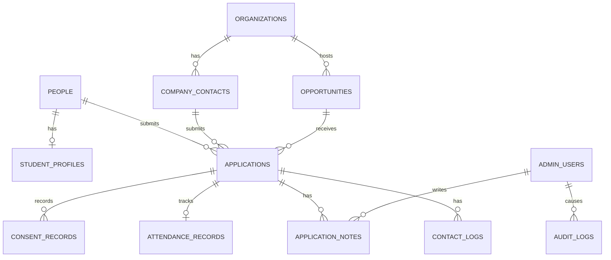

# Table Match 申込・運営管理システム設計書

- 状態: 承認済み・MVP実装済み
- 作成日: 2026-08-14
- 対象: 学生申込、企業申込、申込者向け確認、運営管理ツール、個人情報管理
- 実装状況: 申込フォーム、Supabaseデータモデル、運営ログイン、一覧・詳細・状態・メモ・出欠管理を実装

## 1. 結論

イベント、インターン、会社見学などの募集を、共通の「企画」と「申込」で管理する。

```text
企画を公開
  ↓
学生または企業が企画を選んで申し込む
  ↓
申込内容をデータベースへ保存
  ↓
申込者へ受付メール、運営へ新着通知
  ↓
運営画面で対象企画・申込種別・日時・状態を確認
  ↓
参加確定、待機、辞退、出席、インターン進捗などを更新
```

申込データはメールだけで管理しない。メールは通知として使い、データベースを唯一の正本とする。

### 推奨する構成

- 公開サイト: 既存のNext.js
- 申込処理: Next.js Server Actions
- 入力検証: Zodによるクライアント・サーバー両方の検証
- データベース: Supabase Postgres
- 運営ログイン: Supabase Auth
- 運営認証: MFA必須
- 権限制御: Postgres Row Level Security
- メール: 受付、状態変更、リマインド、運営通知
- 管理画面: 同一サイト内の `/admin`

現在のWeb3Formsは、一般的な問い合わせ専用として残す。イベント・インターン・企業出展申込には使用しない。

## 2. ユーザーと権限

| ユーザー | アカウント | 主な操作 | 個人情報の閲覧範囲 |
| --- | --- | --- | --- |
| 学生申込者 | MVPでは不要 | 申込、確認、変更、辞退 | 自分の申込だけ |
| 企業申込者 | MVPでは不要 | 出展・協賛・募集掲載申込、変更 | 自社の申込だけ |
| 運営スタッフ | 必須 | 担当地域の申込確認、状態変更、出欠 | 担当地域・担当企画のみ |
| 地域責任者 | 必須 | 地域内の企画・申込・メモ管理 | 担当地域すべて |
| 管理者 | 必須 | 全企画、全申込、権限、エクスポート | すべて |
| 参加企業 | 初期版ではログイン不可 | 運営を通じて必要情報を受領 | 本人が明示同意した項目だけ |

学生・企業は、申込完了メール内の有効期限付き管理リンクから内容確認・変更・辞退を行う。パスワード作成を求めない。

## 3. 共通する申込の考え方

### 3.1 申込種別

`application_kind` は次のいずれかとする。

| 値 | 表示 | 主な申込者 |
| --- | --- | --- |
| `event` | イベント参加 | 学生 |
| `internship` | インターン応募 | 学生 |
| `company_visit` | 会社見学 | 学生 |
| `company_participation` | 企業出展 | 企業 |
| `sponsorship` | 協賛・連携 | 企業・自治体・大学 |
| `general_contact` | その他相談 | すべて |

### 3.2 企画との関係

すべての申込は `opportunity_id` を持ち、「どの企画への申込か」を必ず確定する。

- 第6回 Table Match 福岡
- 株式会社○○ 長期インターン
- 株式会社○○ 会社見学会
- Table Match協賛・連携相談

一覧から企画を選んだ場合、申込フォーム上部に企画名、日時、場所、申込種別を読み取り専用で表示する。

## 4. 学生向け申込フォーム

URL:

```text
/apply/[opportunity-slug]
```

### 4.1 画面構成

1. 企画確認
2. 基本情報
3. 学校・関心情報
4. 参加に必要な情報
5. 個人情報と共有同意
6. 入力確認
7. 完了

スマートフォンでは1画面に全項目を並べず、3〜4ステップに分ける。入力途中の進捗を表示し、戻っても入力値を保持する。

### 4.2 イベント参加で取得する項目

| 項目 | 必須 | 形式 | 取得目的 | 運営画面 |
| --- | --- | --- | --- | --- |
| 対象イベント | 必須 | 自動設定 | 参加先の特定 | 一覧・詳細 |
| 氏名 | 必須 | 文字列 | 本人確認、名簿 | 一覧・詳細 |
| フリガナ | 必須 | 文字列 | 読み間違い防止 | 詳細 |
| メールアドレス | 必須 | email | 受付・連絡 | 一覧は一部マスク |
| 電話番号 | 必須 | tel | 当日の緊急連絡 | 一覧は末尾4桁、詳細で表示 |
| 学校名 | 必須 | 文字列 | 対象確認、運営準備 | 一覧・詳細 |
| 学部・学科 | 任意 | 文字列 | グループ設計 | 詳細 |
| 学年 | 必須 | 選択 | 対象確認 | 一覧・詳細 |
| 居住・活動地域 | 任意 | 都道府県 | 地域別案内 | 詳細 |
| 参加目的 | 必須 | 複数選択 | 期待把握 | 一覧タグ・詳細 |
| 興味のある業界 | 任意 | 複数選択 | グループ・企業マッチング | 詳細 |
| 話してみたい企業 | 任意 | 複数選択 | 席・対話設計 | 詳細 |
| 一人参加への不安 | 任意 | 選択＋自由記述 | 当日のサポート | 要対応フラグ |
| 食物アレルギー・配慮事項 | 条件付き | 自由記述 | 食事・安全対応 | 制限付き表示 |
| 要望・質問 | 任意 | 500文字以内 | 個別対応 | 詳細 |
| 写真掲載希望 | 必須 | 可・顔なしのみ・不可 | 撮影運用 | 名簿アイコン |
| 18歳未満確認 | 必須 | はい・いいえ | 保護者同意の要否 | 要対応フラグ |
| 個人情報取扱いへの同意 | 必須 | チェック | 申込処理 | 同意履歴 |
| 参加企業への情報共有 | 任意・別同意 | チェック | イベント後の接続 | 同意履歴 |
| 今後の案内受信 | 任意・別同意 | チェック | メール案内 | 同意履歴 |

### 4.3 参加目的の選択肢

- 自分の興味・やりたいことを見つけたい
- 地域企業について知りたい
- 経営者と話したい
- インターン先を探したい
- 就職先の選択肢を広げたい
- 起業・事業づくりに興味がある
- 他の学生とつながりたい
- その他

### 4.4 インターン応募で追加する項目

| 項目 | 必須 | 内容 |
| --- | --- | --- |
| 希望インターン | 必須 | 対象企画から自動設定 |
| 参加可能時期 | 必須 | 開始可能日・期間 |
| 参加可能頻度 | 必須 | 週の回数・曜日・時間帯 |
| 希望形式 | 必須 | 現地・オンライン・どちらでも |
| 関心を持った理由 | 必須 | 1,000文字以内 |
| 経験・スキル | 任意 | 1,000文字以内 |
| 希望する経験 | 必須 | 複数選択＋自由記述 |
| ポートフォリオURL | 任意 | URL |
| 選考情報の企業共有 | 必須 | 対象企業、項目、目的を明示して同意 |

履歴書ファイルのアップロードは初期版では実装しない。必要になった段階で、暗号化・ウイルス検査・保存期間を別途設計する。

### 4.5 会社見学で追加する項目

- 希望日時（第1〜第3希望）
- 見学で知りたいこと
- 同行者の有無
- 移動上の配慮
- 緊急連絡の要否

### 4.6 学生申込完了画面

- 受付番号
- 企画名、日時、場所
- 現在の状態: `受付済み`
- 次の連絡時期
- 受付メールを送ったメールアドレス
- `申込内容を確認する`
- `予定をカレンダーへ追加`
- `申込を取り消す`

## 5. 企業向け申込フォーム

URL:

```text
/apply/company/[opportunity-slug]
```

### 5.1 画面構成

1. 参加・相談種別
2. 会社・担当者情報
3. 目的と希望
4. 採用・インターン条件
5. 規約・個人情報
6. 入力確認
7. 完了

### 5.2 共通項目

| 項目 | 必須 | 取得目的 |
| --- | --- | --- |
| 申込種別 | 必須 | 出展・協賛・募集掲載を分類 |
| 対象イベント・企画 | 必須 | 対象の特定 |
| 会社・団体名 | 必須 | 法人の特定 |
| 法人番号 | 任意 | 同名企業の識別 |
| Webサイト | 必須 | 事業確認、学生向け紹介 |
| 業種 | 必須 | 掲載・マッチング |
| 所在地 | 必須 | 地域・移動確認 |
| 担当者氏名 | 必須 | 連絡 |
| 部署・役職 | 必須 | 連絡先の役割確認 |
| メールアドレス | 必須 | 受付・連絡 |
| 電話番号 | 必須 | 日程調整・緊急連絡 |
| 希望する連絡方法 | 必須 | メール・電話・どちらでも |
| 参加目的 | 必須 | 採用・広報・共創などを把握 |
| 希望する学生像 | 任意 | 集客・マッチング設計 |
| 当日参加予定者 | 任意 | 席・名札・進行準備 |
| 要望・相談内容 | 任意 | 個別提案 |
| 個人情報取扱いへの同意 | 必須 | 申込処理 |
| 参加規約への同意 | 必須 | 運営ルール確認 |

### 5.3 参加目的の選択肢

- 新卒採用
- インターン採用
- 会社・事業の認知
- 若者の意見収集
- 学生との事業共創
- 地域貢献
- 協賛・連携
- その他

### 5.4 インターン募集掲載で追加する項目

- 募集タイトル
- 業務内容
- 学生が得られる経験
- 対象学年・専攻
- 実施期間
- 勤務頻度・時間
- 勤務場所・オンライン可否
- 報酬・交通費
- 定員
- 選考方法
- 企業担当者
- 応募後の連絡期限

報酬や交通費は「応相談」だけでなく、可能な範囲で金額・条件を記載する。

### 5.5 企業申込完了画面

- 受付番号
- 申込種別・対象企画
- 現在の状態: `受付済み`
- 運営からの連絡目安
- 企業向け資料リンク
- 申込内容の確認・変更リンク

## 6. 個人情報・同意設計

### 6.1 同意を一つにまとめない

次の同意を別々に取得し、それぞれ日時・文面バージョン・取得元を保存する。

1. 申込処理に必要な個人情報の取扱い: 必須
2. 参加企業への個人情報提供: 任意または企画上必要な場合に明示
3. 今後のイベント案内: 任意
4. 写真・動画の撮影と掲載: 可・顔なしのみ・不可
5. 食物アレルギー等の配慮情報: 該当者のみ

### 6.2 企業へ共有する情報

参加企業へ学生情報を自動的に公開しない。

共有する場合は、フォーム上で以下を明示する。

- 提供先企業名
- 提供する項目
- 利用目的
- 提供時期
- 連絡可能な期間
- 同意しなくてもイベント参加に不利益がないか

初期設定では、会社名・氏名・大学・関心事項を候補とし、電話番号とメールアドレスは本人が明示同意した場合だけ提供する。

### 6.3 食物アレルギー・配慮事項

- 食事のある企画だけ表示する。
- 一般の運営スタッフには「対応あり」のフラグだけ見せる。
- 内容は地域責任者・管理者だけが閲覧できる。
- イベント終了30日後に削除する。
- 自由記述を他用途へ使わない。

### 6.4 保存期間の提案

| データ | 保存期間案 | 期間後の処理 |
| --- | --- | --- |
| イベント申込の連絡先 | イベント終了後1年 | 氏名・連絡先を削除または匿名化 |
| インターン応募 | 選考・実施終了後1年 | 個人識別項目を削除 |
| 会社見学申込 | 見学終了後1年 | 個人識別項目を削除 |
| アレルギー・配慮情報 | イベント終了後30日 | 完全削除 |
| 今後の案内同意 | 同意撤回または2年反応なし | 配信停止・削除 |
| 匿名集計 | 期限なし | 個人を再識別できない形で保持 |
| 操作監査ログ | 2年 | ローテーション削除 |

保存期間は運営方針と専門家確認を経て確定する。

## 7. 申込状態

### 7.1 イベント

```text
受付済み → 確認中 → 参加確定 → 出席
                    ↘ 欠席
          ↘ 待機 → 参加確定
受付済み・確認中・確定・待機 → 辞退
```

DB値:

`submitted`, `reviewing`, `confirmed`, `waitlisted`, `cancelled`, `attended`, `no_show`

### 7.2 インターン

```text
受付済み → 書類確認 → 企業紹介 → 面談 → 参加決定 → 実施中 → 完了
              ↘ 見送り      ↘ 辞退
```

DB値:

`submitted`, `screening`, `introduced`, `interview`, `accepted`, `active`, `completed`, `declined`, `withdrawn`

### 7.3 企業

```text
受付済み → 連絡済み → 打合せ → 提案済み → 参加確定 → 実施完了
                                  ↘ 見送り
```

DB値:

`submitted`, `contacted`, `meeting`, `proposal`, `confirmed`, `completed`, `declined`

状態変更時は、変更者・変更前・変更後・日時を監査ログに残す。

## 8. 運営管理ツール

URL:

```text
/admin/login
/admin
```

### 8.1 ナビゲーション

- ダッシュボード
- 申込一覧
- イベント
- インターン・会社見学
- 企業
- カレンダー
- 通知
- 操作履歴
- メンバー・権限
- 設定

### 8.2 ダッシュボード

```text
┌─────────────────────────────────────────┐
│ 次回イベント: 第6回 Table Match 福岡       │
│ 参加確定 18 / 定員 30   待機 2   未確認 4    │
├──────────┬──────────┬──────────┤
│ 今日の新着  │ 要対応       │ 今週の予定    │
│ 6件         │ 3件          │ 2企画         │
├─────────────────────────────────────────┤
│ 直近の申込                                   │
│ 日時 / 氏名 / 種別 / 対象企画 / 状態 / 担当   │
├─────────────────────────────────────────┤
│ カレンダー: イベント・面談・会社見学           │
└─────────────────────────────────────────┘
```

### 8.3 申込一覧

表示列:

- 申込日時
- 氏名・企業名
- 学生 / 企業
- 申込種別
- 対象イベント・インターン
- 開催日・開始予定日
- 状態
- 担当地域
- 担当者
- 要対応フラグ

フィルター:

- 地域: 長野 / 福岡 / その他
- 申込種別
- 企画
- 開催日
- 状態
- 学校・企業
- 担当者
- 同意状態
- 要対応

検索対象:

- 氏名
- 会社名
- 学校名
- 受付番号
- 電話番号末尾4桁

### 8.4 申込詳細

```text
申込者概要
├── 氏名、所属、メール、電話
├── 申込種別、対象企画、日時
├── 現在の状態、担当者
├── 希望・要望・関心
├── 同意履歴
├── 運営メモ
├── 連絡履歴
└── 状態変更履歴
```

操作:

- 状態変更
- 担当者設定
- 確認メール再送
- 運営メモ追加
- 連絡履歴追加
- 申込者の変更依頼を反映
- 辞退処理
- 個人情報の削除依頼を処理

### 8.5 イベント名簿

- 参加確定者だけの当日名簿
- 学校・学年・希望企業
- 写真掲載希望
- 要対応フラグ
- 受付チェックイン
- 出席 / 欠席
- 名札用表示名
- 座席・グループ

電話番号やアレルギー内容は通常の名簿には表示しない。緊急連絡権限を持つ責任者だけが開く。

### 8.6 インターン管理

カンバン表示:

```text
受付済み | 書類確認 | 企業紹介 | 面談 | 参加決定 | 実施中 | 完了
```

各カード:

- 学生名
- 大学・学年
- 対象企業・インターン
- 応募日
- 参加可能時期
- 次のアクション日
- 担当者

「いつ誰がどこへ参加するか」は、カレンダーとインターン管理の両方で確認できる。

### 8.7 カレンダー

表示対象:

- Table Matchイベント
- 会社見学
- インターン開始・終了
- 学生と企業の面談
- 運営のフォロー予定

表示切替:

- 月 / 週 / リスト
- 長野 / 福岡
- イベント / インターン / 見学 / 面談
- 担当者

### 8.8 CSV出力

- 初期状態は必要最小限の列だけ出力する。
- 電話・メールを含む完全版は管理者だけが実行できる。
- 出力理由を必須入力する。
- 実行者、日時、対象、出力列、件数を監査ログへ保存する。
- 出力ファイルは管理システム内に長期保存しない。

## 9. 通知設計

### 申込者へ

- 申込受付
- 参加確定 / 待機 / 見送り
- 内容変更
- 開催3日前リマインド
- 開催前日リマインド
- 開催変更・中止
- お礼と次の案内

### 運営へ

- 新規申込
- 18歳未満
- 配慮事項あり
- 辞退
- 定員到達
- 待機発生
- 連絡期限超過
- インターンの次アクション期限

通知メールには必要最小限の情報だけ記載し、電話番号や配慮内容は書かない。詳細は運営画面で確認する。

## 10. データモデル



### 10.1 主なテーブル

| テーブル | 役割 | 主な項目 |
| --- | --- | --- |
| `people` | 申込者の基本情報 | name, kana, email, phone |
| `student_profiles` | 学生情報 | school, faculty, grade, region |
| `organizations` | 企業・大学・団体 | name, website, industry, address |
| `company_contacts` | 企業担当者 | organization_id, name, role, email, phone |
| `opportunities` | イベント・インターン・見学 | type, title, region, start_at, end_at, capacity |
| `applications` | 申込本体 | opportunity_id, applicant, kind, status, requests |
| `consent_records` | 同意の証拠 | type, granted, policy_version, captured_at, source |
| `attendance_records` | 当日出欠 | checked_in_at, result, group_name |
| `application_notes` | 運営メモ | body, visibility, author_id |
| `contact_logs` | 連絡履歴 | channel, summary, contacted_at |
| `admin_users` | 運営アカウント | role, region, active |
| `audit_logs` | 操作履歴 | actor, action, target, before, after, created_at |

電話、メール、配慮情報は一覧取得しやすい自由形式JSONへ入れず、アクセス制御できる専用列・専用テーブルで保持する。

## 11. セキュリティ要件

- 公開フォームからデータベースを直接読み取れない。
- 送信は同一オリジンのServer Action経由とする。
- クライアント検証だけに頼らず、サーバーでZod検証する。
- 公開フォームにレート制限、honeypot、必要時のみCAPTCHAを実装する。
- 管理者用秘密鍵をブラウザへ送らない。
- 全テーブルでRLSを有効にする。
- 運営アカウントはMFA必須とする。
- 権限は `staff`, `regional_manager`, `admin` に分ける。
- 認証成功・失敗、データ閲覧、状態変更、CSV出力、権限変更を記録する。
- パスワード、認証トークン、同意リンクの生トークンをログへ記録しない。
- 運営メンバー退任時は当日中にアカウントを無効化する。
- 本番データを開発・テスト環境へコピーしない。
- バックアップと復元手順を確認する。

## 12. 個人情報保護方針へ追加する内容

- 取得する情報
- 具体的な利用目的
- 保存期間
- 委託先サービス
- 第三者提供の条件
- 海外での取扱いがある場合の説明
- 開示・訂正・削除・利用停止の受付方法
- 安全管理措置の概要
- 苦情・問い合わせ窓口
- 改定日とバージョン

個人情報保護委員会のガイドラインでは、利用目的をできる限り具体的に特定し、本人へ通知・公表すること、第三者提供は原則として事前同意を得ること、安全管理措置を講じることが求められている。本設計は法的助言ではないため、公開前に運営責任者または専門家が最終確認する。

## 13. 実装フェーズ

### Phase 1: 申込と一覧管理

- SupabaseプロジェクトとDB
- 企画データ
- 学生イベント申込
- 企業参加申込
- 受付メール
- `/admin/login`
- 申込一覧・詳細・状態変更
- イベント名簿
- 権限と監査ログ

### Phase 2: インターン・日程管理

- インターン応募項目
- カンバン
- カレンダー
- 面談・会社見学予定
- 自動リマインド
- CSV出力制御

### Phase 3: 高度な運用

- 申込者の変更・辞退ページ
- 企業向け限定ポータル
- 席・グループ編成
- 集計ダッシュボード
- 保存期間に基づく自動匿名化・削除

## 14. 受け入れ基準

- 申込に対象企画と申込種別が必ず紐づく。
- 学生と企業で不要な項目を表示しない。
- 電話番号、氏名、要望を構造化して検索できる。
- 運営が「いつ、誰が、どのイベント・インターンへ、どの状態で参加するか」を一覧とカレンダーで確認できる。
- 一人が複数企画へ申し込んでも履歴が統合される。
- 参加企業へ学生の連絡先が自動共有されない。
- 同意文面のバージョンと取得日時を保存できる。
- 権限外の地域・企画・配慮情報へアクセスできない。
- 重要操作を監査ログで追跡できる。
- 申込完了、エラー、重複申込、満席、待機を適切に表示できる。
- 保存期間後に削除・匿名化できる。

## 15. 実装前に承認が必要な項目

以下が確定するまで実装を開始しない。

1. 学生申込の必須項目
2. 企業申込の必須項目
3. 参加企業へ共有する学生情報と同意方法
4. アレルギー・配慮事項を取得するか
5. 提案した保存期間
6. 運営権限の3段階と担当者
7. Supabaseを採用するか
8. 運営通知に使うメールアドレス
9. 申込者向けメールの送信元
10. 管理画面でCSV出力が必要か

## 16. 参考資料

- [個人情報保護委員会: 個人情報保護法ガイドライン（通則編）](https://www.ppc.go.jp/personalinfo/legal/guidelines_tsusoku/)
- [個人情報保護委員会: 利用目的をどこまで詳細に示すか](https://www.ppc.go.jp/all_faq_index/faq4-q103/)
- [個人情報保護委員会: 第三者提供の制限](https://www.ppc.go.jp/all_faq_index/faq4-q301/)
- [IPA: 中小企業の情報セキュリティ対策ガイドライン](https://www.ipa.go.jp/security/guide/sme/about.html)
- [OWASP ASVS](https://owasp.org/www-project-application-security-verification-standard/)
- [OWASP Authentication Cheat Sheet](https://cheatsheetseries.owasp.org/cheatsheets/Authentication_Cheat_Sheet.html)
- [OWASP Logging Cheat Sheet](https://cheatsheetseries.owasp.org/cheatsheets/Logging_Cheat_Sheet.html)
- [Next.js: Forms with Server Actions](https://nextjs.org/docs/app/guides/forms)
- [Supabase: Row Level Security](https://supabase.com/docs/guides/database/postgres/row-level-security)
- [Supabase: Multi-Factor Authentication](https://supabase.com/docs/guides/auth/auth-mfa)
